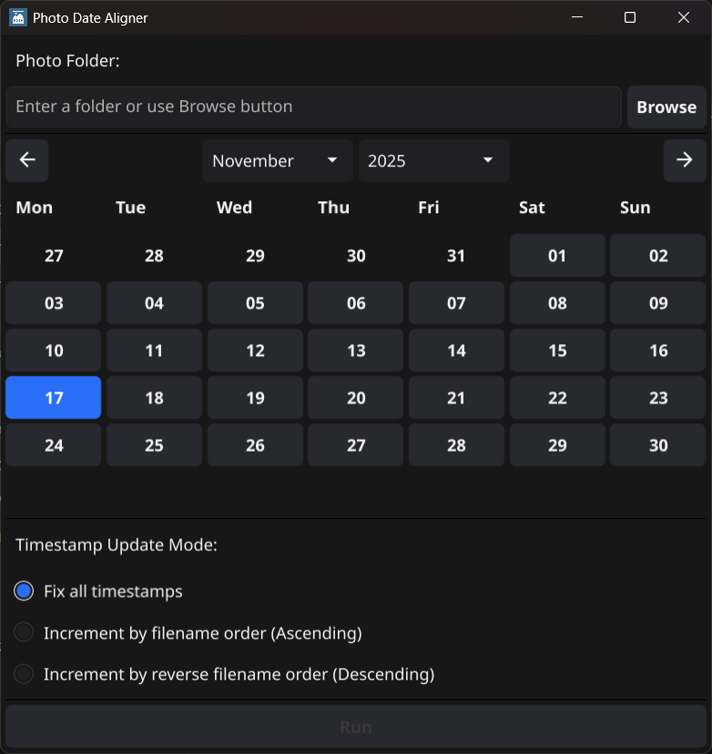

# Photo Date Aligner

## Photo Date Aligner について / About Photo Date Aligner

Photo Date Aligner は、フォルダ内の JPG 写真の撮影日時をまとめて整えるためのシンプルなツールです。元ファイルは変更せず、更新後の写真を別フォルダに出力します。  
Photo Date Aligner is a simple tool for batch-adjusting the timestamp of JPG photos inside a folder.
The original files are never modified, and updated photos are saved into a separate folder.

## 使い方 / How to Use

### 1. フォルダを指定する / Select a Folder
画面上部の `Photo Folder` 欄に対象フォルダのパスを入力するか、右側の `Browse` ボタンからフォルダを選択します。  
Enter the path in the `Photo Folder` field at the top, or select a folder using the `Browse` button.

### 2. 日付を選ぶ / Choose a Date
中央のカレンダーから、写真に設定したい **年月日** を選びます。  選択した日付の **0:00:00** が基準時刻として使用されます。  
Select the **year, month, and day** from the calendar. The selected date’s **0:00:00** will be used as the base timestamp.

### 3. 更新モードを選ぶ / Select a Timestamp Update Mode
`Timestamp Update Mode` から、次のいずれかを選択します。  
Choose one of the options under `Timestamp Update Mode`.

- `Fix all timestamps`  
  すべての写真を選択日付の **0:00:00** に統一します。  
  All photos will be set to **0:00:00 on the selected date**.

- `Increment by filename order (Ascending)`  
  ファイル名順に並べ、0:00:00 から **1分ずつずらして** 時刻を設定します。  
  Sort files by name in ascending order and assign timestamps by **adding 1 minute step-by-step** starting from 0:00:00.

- `Increment by reverse filename order (Descending)`  
  ファイル名逆順に並べ、0:00:00 から **1分ずつずらして** 時刻を設定します。  
  Sort files by name in descending order and assign timestamps by **adding 1 minute step-by-step** starting from 0:00:00.

### 4. 実行する / Run the Process
画面下部の `Run` ボタンを押して処理を開始します。  
Press the `Run` button at the bottom to start processing.

- 元ファイルは変更しません。  
The original files will NOT be modified.

- 指定フォルダと同じ場所に **「<フォルダ名>_update」** フォルダを作成し、結果を出力します。  
A folder named **“<folder>_update”** will be created next to the original folder, and the updated photos will be saved there.

## Defender の警告画面で実行する方法 / How to Run the App When Defender Shows a Warning

初回起動すると  **「Windows はお使いの PC を保護しました」** という画面が表示されることがあります。  
When you start the app for the first time,  you may see a screen saying **“Windows protected your PC.”**

このアプリは個人開発で、**コード署名証明書を付けていません**。
そのため Windows が「発行元が確認できないアプリ」と判断し、安全確認のため警告画面が表示されます。  
This app is individually developed and **does not include a code-signing certificate**.
Windows therefore cannot verify the publisher and shows this warning
as a safety confirmation.

怪しい処理はしていません。心配な場合はソースコードをご確認ください。  
We do not perform any suspicious operations. If you have concerns, please review the source code.

### 実行手順／How to Run It
1. 警告画面左側の **「詳細情報」** をクリックします。  
   Click **“More info”** on the left side of the warning screen.  
2. 下部に **「実行」** ボタンが表示されます。
   A new button labeled **“Run anyway”** will appear at the bottom.  
3. **「実行」** をクリックするとアプリが起動します。
   Click **“Run anyway”** to launch the app.

## Dependencies
- [Fyne](https://github.com/fyne-io/fyne) — Cross-platform GUI framework  
- [fyne-datepicker](https://github.com/sdassow/fyne-datepicker) — DatePicker widget for Fyne (used for date selection UI)
- [sqweek/dialog](https://github.com/sqweek/dialog) — Native file/folder selection dialogs  
- [go-exif](https://github.com/dsoprea/go-exif) — EXIF metadata handler  
- [go-jpeg-image-structure](https://github.com/dsoprea/go-jpeg-image-structure) — JPEG parser/writer

## License
This project is licensed under the MIT License – see the [LICENSE](LICENSE) file for details.
